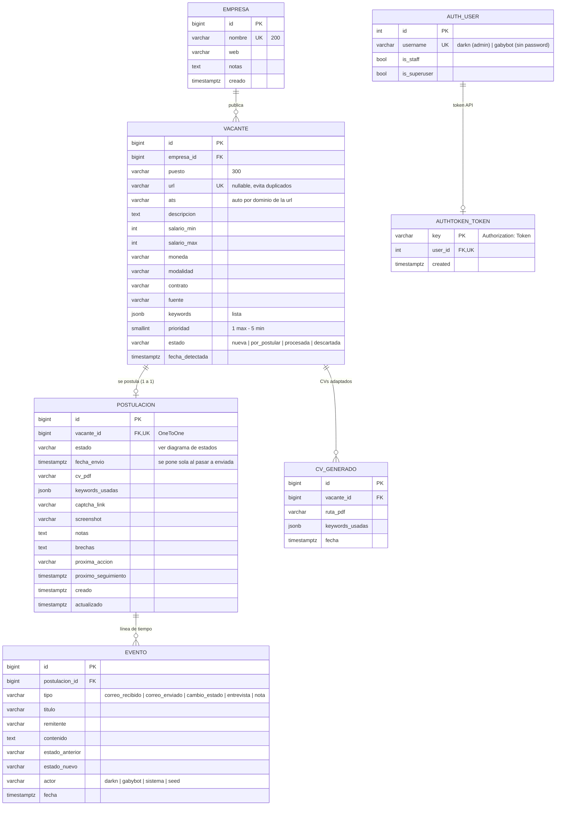
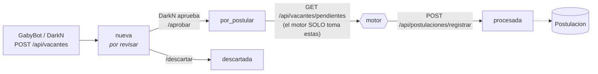
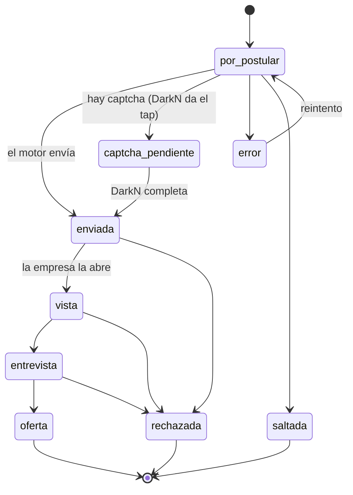

# 🗄️ Base de datos — Job Machine

PostgreSQL 16 · app Django `tracker` (`web/backend/tracker/models.py`).
Los diagramas son Mermaid: GitHub los dibuja solos.

## Diagrama entidad-relación



Borrados en cascada: borrar una **Empresa** borra sus vacantes → postulaciones → eventos y CVs.

`AUTH_USER`/`AUTHTOKEN_TOKEN` son tablas de Django (simplificadas aquí); no se relacionan con el
tracker por FK: el usuario que hace un cambio queda como texto en `Evento.actor`.

## Flujo de una vacante



## Estados de una postulación

Cada cambio de estado crea automáticamente un `Evento` (`tipo=cambio_estado`, con `actor`).



| grupo (para las estadísticas) | estados |
|---|---|
| **Enviadas** | enviada, vista, entrevista, oferta, rechazada |
| **Con respuesta** | vista, entrevista, oferta, rechazada |
| **Activas** | enviada, vista, entrevista, oferta, captcha_pendiente |

El panel permite mover entre cualquier estado (Kanban); el diagrama muestra el camino normal.

## Ver la base real

```bash
# Consola SQL en producción
ssh darkn@158.220.126.87
cd /opt/job-machine && sudo -u deploy docker compose -f docker-compose.prod.yml exec db \
  sh -c 'psql -U "$POSTGRES_USER" "$POSTGRES_DB"'
#   \dt tracker_*            tablas
#   \d tracker_postulacion   columnas e índices
```

También: Django admin en `/admin/` y la API documentada en `/api/docs` (Swagger).
